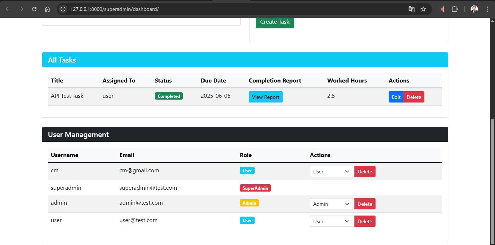

# Task Management Application

A Django-based task management system with task completion reporting functionality.

## Features

- User Authentication (JWT-based)
- Task Management with Completion Reports
- Role-based Access Control (SuperAdmin, Admin, User)
- Task Status Tracking (Pending, In Progress, Completed)
- Work Hours Tracking
- Task Completion Reports
- Admin Dashboard for SuperAdmins and Admins
- User Dashboard for Task Owners

## Requirements

- Python 3.8+
- Django 4.0+
- Django REST Framework
- djangorestframework-simplejwt
- SQLite (default)

## Installation

1. Create a virtual environment:
```bash
python -m venv venv
source venv/bin/activate  # On Windows: venv\Scripts\activate
```

2. Install dependencies:
```bash
pip install -r requirements.txt
```

3. Apply migrations:
```bash
python manage.py migrate
```

4. Create a superuser:
```bash
python manage.py createsuperuser
```

5. Run the development server:
```bash
python manage.py runserver
```

## API Endpoints

### Authentication
- POST /api/token/ - Obtain JWT token
- POST /api/token/refresh/ - Refresh JWT token

### Tasks
- GET /api/tasks/ - List all tasks (for SuperAdmin)
- GET /api/tasks/?assigned_to=<user_id> - List tasks for specific user
- PUT /api/tasks/<id>/ - Update task status and completion details
- GET /api/tasks/<id>/report/ - View completion report

## Usage

1. Log in as SuperAdmin to manage users and tasks
2. Log in as Admin to manage tasks and view reports
3. Log in as User to complete tasks and submit reports

## Security

- JWT authentication for all API endpoints
- Role-based access control
- Password hashing for user authentication
- CSRF protection for web forms

## Contributing

1. Fork the repository
2. Create your feature branch
3. Commit your changes
4. Push to the branch
5. Create a Pull Request

## 📸 Project Screenshots

### 🔐 Login Page


### 📊 SuperAdmin Dashboard



### 🔑 JWT Token Endpoint (DRF)


### 🧪 Token Test Form


### 🚧 Task API Endpoint


### ⚙️ Django Admin Panel

